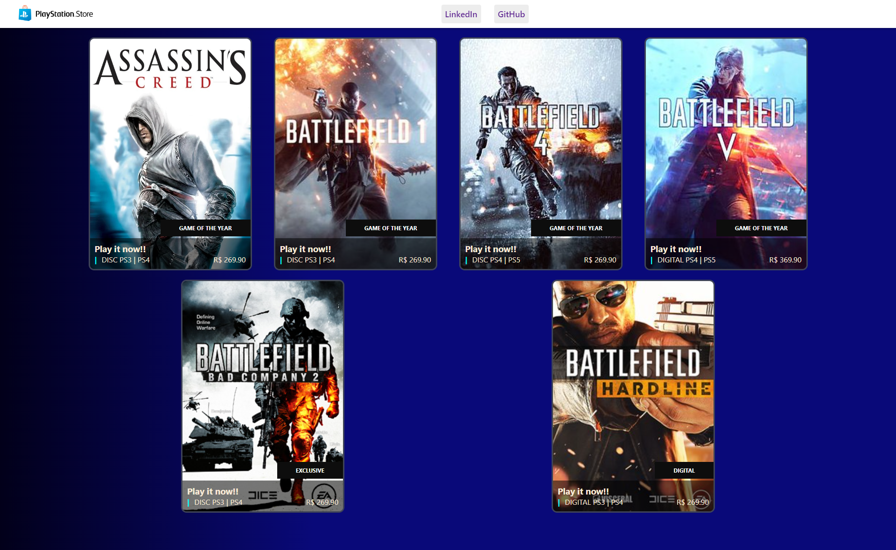

<div align="center">
  <h1>PSN Store</h1>
</div>

<p align="center">
  <a href="#project">Project</a>&nbsp;&nbsp;&nbsp;|&nbsp;&nbsp;&nbsp;
  <a href="#-technologies">Technologies</a>&nbsp;&nbsp;&nbsp;|&nbsp;&nbsp;&nbsp;
  <a href="#-Getting started">Getting started</a>&nbsp;&nbsp;&nbsp;|&nbsp;&nbsp;&nbsp;
  <a href="#-license">License</a>
</p>

<br>

<p align="center">
  
</p>

<h1 align="center">
    
</h1>


## 💻 Projeto

Application to learn how to create a angular project, create and manipulate a minimal part of the component and make dynamic pages content!


## 🧪 Technologies

This project was developed using the following technologies:
 
- [Angular](https://angular.io)
- [HTML](https://developer.mozilla.org/pt-BR/docs/Web/HTML)
- [CSS](https://developer.mozilla.org/pt-BR/docs/Web/CSS)
- [Typescript](https://www.typescriptlang.org)

## 🚀 Getting started

Clone the project and access the folder.

```bash
$ git clone https://github.com/MaykonRaphael/angular-psn-store.git
$ cd angular-psn-store
```

Follow the steps below:
```bash
# Start the project
$ ng server

# Open this in browser
$ http://localhost:4200/
```

## 📝 License

This project is licensed under the MIT License. See the [LICENSE](LICENSE.md) file for details.

---
<p align="center">
  Made by Maykon Raphael 👋
</p>
